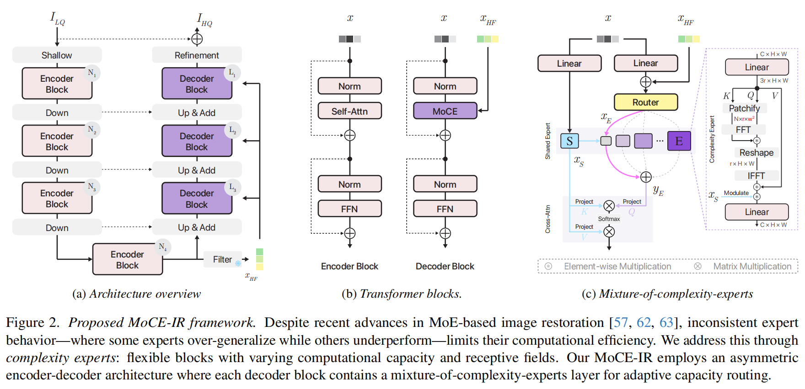
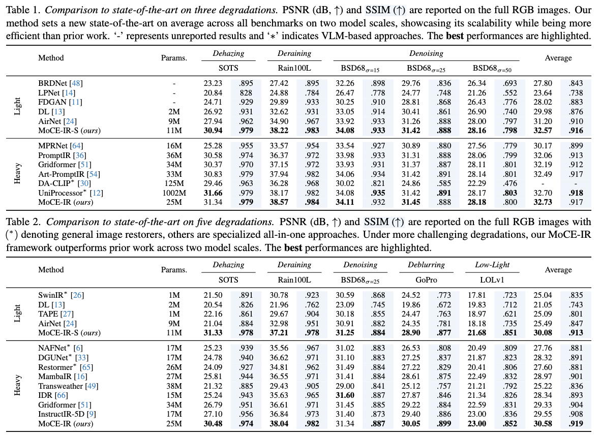

# 2025-CVPR-Complexity Experts are Task-Discriminative Learners for Any Image Restoration

这篇论文介绍了一种名为MoCE-IR的新框架，用于图像修复，它利用“复杂性专家”——具有不同计算复杂性的灵活专家块，以增强特定任务的学习. 传统的混合专家(MoE)模型通常不能充分利用与特定任务相关的参数，从而限制了它们在处理多种图像退化类型时的效率。该框架引入了一种复杂度感知的分配机制，根据任务的复杂性将任务引导给专家，并支持在推理过程中有效绕过不相关的专家。这种新模型通过有效地保持修复质量，同时提高计算效率，从而胜过最新的方法。这项研究在一体化图像修复方法上取得了显著进展，确保了与特定退化需求相一致的自适应处理。MoCE-IR模型优于state-of-the-art方法，证明了其效率和实际应用性。该模型通过动态地调整处理能力以匹配任务需求，从而克服了图像修复中统一MoE架构的局限性。该框架采用非对称编码器-解码器架构，其中每个解码器块包含一个混合复杂性专家层，用于自适应容量路由。该模型还整合了高频引导，通过Sobel滤波的全局特征向量来提高门控功能的频率感知。

代码：https://github.com/eduardzamfir/MoCE-IR

项目主页：https://eduardzamfir.github.io/moceir/

## 摘要

近年来，集多种功能于一体的图像恢复模型在通过统一框架处理多样性退化问题方面取得了突破性进展。然而，**绑定于特定任务的参数在面对其他任务时常常处于非激活状态，这使得专家混合（Mixture-of-Experts, MoE）架构成为自然的延伸选择。**尽管如此，MoE 往往表现出不一致的行为：有些专家会在多个任务间意外泛化，而另一些专家甚至在其目标任务内表现不佳。这种情况阻碍了在推理过程中通过跳过无关专家以提升计算效率的尝试。我们认为，传统 MoE 的统一和僵化架构导致了这种不理想的表现。**为此，我们提出了“复杂度专家”——采用不同计算复杂度和感受野的灵活专家模块。**一个核心挑战是如何为每个专家分配任务，因为退化的复杂性事先未知。因此，我们在执行任务时采取了简单地偏向较低复杂度的策略。令人惊讶的是，这种偏好实际上有效推动了任务的特定分配，使任务能匹配到合适复杂度的专家。大量实验验证了我们的方法，在保证卓越性能的同时，实现了在推理时绕过无关专家的能力。我们提出的 MoCE-IR 模型超越了最新方法，展现出其高效性和实际应用价值。源代码和模型已在 eduardzamfir.github.io/MoCE-IR/ 公开发布。

## 1. 引言

图像恢复 [47, 67, 68] 是计算机视觉中的一个基础性问题，旨在从退化的观测中重建高质量的图像。诸如噪声 [22, 67]、雾霾 [5, 38] 或雨滴 [7, 59] 等不利条件，会极大影响图像在自动驾驶 [7, 49]、增强现实 [10, 15, 45] 等多个领域下游应用的实际效果。基于深度学习的方法极大推动了该领域的进步，尤其是在面向特定任务的图像恢复问题 [6, 8, 16, 28, 52, 65] 上。

近期的一体化图像恢复模型 [9, 12, 13, 24, 27, 36, 49, 66] 展示了在单一模型中同时处理多种退化类型的可能性，相较于传统针对单一任务的方法，这更加实用，也无需针对每种新退化类型进行大量重新训练。值得注意的工作还包括基于视觉 [25, 36, 50] 或语言的提示 [1, 9, 30]、对比学习 [24, 66] 及扩散模型 [1, 30]。

尽管取得了一定的成功，我们观察到上述模型往往存在低效现象：**绑定于特定退化类型的参数，在处理其他任务时经常处于非激活或利用不足的状态 [57]。**这自然而然地表明，**可以采用专家混合（Mixture-of-Experts, MoE）架构来实现任务特定的处理。然而，现有基于 MoE 的方法 [29, 57, 62] 通常依赖于基于语言 [57] 或退化先验 [29, 62] 的路由机制，<u>这导致部分专家能够较好泛化，而另一些专家却难以胜任其目标任务，从而带来了优化失衡。</u>**这种不一致限制了在推理阶段绕过无关专家、提升计算效益的可能性。

我们认为，上述不理想行为主要源于两个问题。首先，**现有 MoE 架构的统一且僵化的结构无法满足不同恢复任务对复杂性需求的差异。**例如，运动模糊需要局部处理和强空间感知，去雾则要求更广泛的上下文理解 [4, 35]，这意味着需要**<u>与任务需求相适应的自适应处理机制</u>**。其次，恰当分配任务的难点在于，事先并不知道每种退化类型的复杂性。一般来说，MoE 模型 [37, 39, 43, 70] 力图平衡专家利用，避免模型退化为依赖单一专家。

为解决这些挑战，我们提出了一种**<u>面向一体化图像恢复的全新复杂度专家混合（MoCE）框架。</u>**我们的核心创新在于，设计了计算复杂度和感受野不断递增的专家模块，**<u>使模型能根据任务需求自适应匹配计算能力。</u>**为应对路由难题，**<u>我们引入了一种复杂度感知的分配机制，优先将任务分配给复杂度较低的专家。</u>**此方法通过类似机械弹簧力的复杂度比例偏置项引导专家选择。令人惊讶的是，这一简单策略能有效实现任务特定的分配，自然将输入引导至合适复杂度的专家。MoCE 框架带来了两大显著优势：**<u>首先，模型可在推理阶段选择性绕过无关专家，显著减少计算开销</u>**；**<u>其次，在多样任务下依然保持高质量的恢复表现</u>**。大量实验验证表明，我们提出的方法不仅保证了恢复质量，还超越了最新的主流方法。这些结果验证了复杂度专家设计和路由策略的有效性，也展示了其实用价值。我们的方法为一体化图像恢复领域树立了新基准，实现了高效性与保真度的双提升。

本工作的主要贡献如下：

- 我们提出了 MoCE-IR，能够以更高效的方式实现一体化图像恢复任务的最新性能；
- 我们的创新 MoE 层根据输入需求选择性激活复杂度专家，实现了单一架构下的任务特定与整体学习的统一；
- 我们开发了复杂度感知路由机制，能够通过自适应专家分配，在保持恢复质量的同时提升计算效率。

## 2. 相关工作

**任务专用的图像恢复。**
将退化图像重建为干净图像是一个高度不适定的问题，但大量研究已从数据驱动的学习视角对图像恢复展开探索，相比早期手工设计的方法取得了重大进展 [22, 26, 47, 52, 65, 67, 68]。大多数方法基于卷积网络 [6, 47, 67, 68] 或 Transformer 架构 [8, 28, 52, 65]，专门应对单一退化任务，如去噪 [8, 67, 68]、去雾 [41, 42, 55] 或去雨 [18, 40]。与基于 CNN 的网络不同，Transformer 能更好地捕获全局依赖，使其在图像恢复中表现突出 [28, 65, 69]。然而，自注意力机制计算复杂度与图像尺寸成二次增长，这对资源受限的应用是个挑战。相比之下，卷积在提供有限全局上下文的前提下实现高效处理，且对输入尺寸的扩展性更好。**近期，FFTformer [21] 在傅里叶域高效近似了查询与键之间的交互，显著降低了图像去模糊任务中较窗口注意力法的计算开销。**在此基础上，我们在 Transformer 架构 [65] 内引入了专用专家模块，有效捕获共享与专属上下文信息，应对不同图像恢复任务的多样需求。

**一体化图像恢复。**
恢复退化图像往往需要多个模型，实际工程落地复杂，尤其是图像包含多种退化时。当前兴起了一体化图像恢复研究，利用单一深度盲恢复模型同时应对多重退化类型 [7, 19, 36, 49, 64, 66]。开创性工作 AirNet [24] 通过对比学习提取退化特征指导恢复，实现了盲的一体化恢复。同样，IDR [66] 采用基于元学习的两阶段方法，结合物理机制建模退化过程。基于提示（Prompt-based）的学习 [25, 36, 50] 亦日益流行，其中 [36] 通过可调提示编码特定退化信息，但模型参数量较大。随着多模态集成（如图像与文本结合）的进展，语言引导的图像恢复逐渐受到关注，如 DA-CLIP [30]、InstructIR [9]、UniProcessor [12] 等工作。**然而，这些方法往往依赖高质量文本提示和大规模语言模型（LLM），不利于资源受限设备。**而我们的贡献在于提出一种新颖且参数高效的选择性激活方法，有效兼顾多样退化的处理需求，同时保证模型轻量自适应。

**动态网络。**
动态网络已从早期的条件计算 [3] 发展到精细的专家混合（MoE）架构，能够在扩大模型容量的同时维持高效推理开销 [37, 43, 46]。在 Transformer 的 NLP 及高层视觉任务上表现尤为突出。在图像恢复领域，Path-Restore [60] 提出了基于内容感知的块间路由，并用难度奖励机制辅助优化；近期一体化模型 [29, 57, 62] 则借助多种先验进行专家路由。我们的工作关注如何在通用恢复框架下自适应地将受损图像路由到合适的计算模块，通过动态对齐图像特征与计算需求，实现了参数和结构空间的统一，突破了以往方法的瓶颈。

## 3. 方法

本节将介绍我们一体化图像恢复方法的核心原理。如图2a所示，我们的流程采用了**<u>U型架构</u>** [44, 65]，并设计为非对称的编码器-解码器结构。首先，**利用一个3×3卷积核从退化输入中提取低阶特征**，这些特征随后经过4级编码和解码阶段。**编码与解码阶段均采用了Transformer模块** [36, 65]，而<u>**我们创新的MoCE层则仅集成在解码器模块内**</u>（见图2b）。为进一步提升解码器的特征表征能力，**我们通过<u>Sobel滤波</u>提取的全局高频特征引入高频引导，以增强门控函数对频率信息的感知。最后，通过<u>全局残差连接</u>，将浅层特征与精细化阶段的输出相加，进一步增强高频细节，然后生成恢复后的图像。**

```
class MoCEIR(nn.Module):
    def __init__(self,
                inp_channels=3, 
                out_channels=3, 
                dim = 32,
                levels: int = 4,
                heads = [1,1,1,1],
                num_blocks = [1,1,1,3],
                num_dec_blocks = [1, 1, 1],
                ffn_expansion_factor = 2,
                num_refinement_blocks = 1,
                LayerNorm_type = 'WithBias', ## Other option 'BiasFree'
                bias = False,
                rank=2,
                num_experts=4,
                depth_type="lin",
                stage_depth=[3,2,1],
                rank_type="constant",
                topk=1,
                expert_layer=FFTAttention,
                with_complexity=False,
                complexity_scale="max",
                ):
        super(MoCEIR, self).__init__()
        
        self.levels = levels
        self.num_blocks = num_blocks
        self.num_dec_blocks = num_dec_blocks
        self.num_refinement_blocks = num_refinement_blocks
        
        dims = [dim*2**i for i in range(levels)]
        ranks = [rank for i in range(levels-1)]

        # -- Patch Embedding
        self.patch_embed = OverlapPatchEmbed(in_c=inp_channels, embed_dim=dim, bias=False)
        self.freq_embed = FrequencyEmbedding(dims[-1])
                
        # -- Encoder --        
        self.enc = nn.ModuleList([])
        for i in range(levels-1):
            self.enc.append(nn.ModuleList([
                EncoderResidualGroup(
                    dim=dims[i], 
                    num_blocks=num_blocks[i], 
                    num_heads=heads[i],
                    ffn_expansion=ffn_expansion_factor, 
                    LayerNorm_type=LayerNorm_type, bias=True,),
                Downsample(dim*2**i)
                ])
            )
        
        # -- Latent --
        self.latent = EncoderResidualGroup(
            dim=dims[-1],
            num_blocks=num_blocks[-1], 
            num_heads=heads[-1], 
            ffn_expansion=ffn_expansion_factor,
            LayerNorm_type=LayerNorm_type, bias=True,)
                  
        # -- Decoder --
        dims = dims[::-1]
        ranks = ranks[::-1]
        heads = heads[::-1]
        num_dec_blocks = num_dec_blocks[::-1]
        
        self.dec = nn.ModuleList([])
        for i in range(levels-1):
            self.dec.append(nn.ModuleList([
                Upsample(dims[i]),
                nn.Conv2d(dims[i], dims[i+1], kernel_size=1, bias=bias),
                DecoderResidualGroup(
                    dim=dims[i+1],
                    num_blocks=num_dec_blocks[i], 
                    num_heads=heads[i+1],
                    ffn_expansion=ffn_expansion_factor, 
                    LayerNorm_type=LayerNorm_type, bias=bias, expert_layer=expert_layer, freq_dim=dims[0], with_complexity=with_complexity,
                    rank=ranks[i], num_experts=num_experts, stage_depth=stage_depth[i], depth_type=depth_type, rank_type=rank_type, top_k=topk, complexity_scale=complexity_scale),
                ])
            )

        # -- Refinement --
        heads = heads[::-1]
        self.refinement = EncoderResidualGroup(
            dim=dim,
            num_blocks=num_refinement_blocks, 
            num_heads=heads[0], 
            ffn_expansion=ffn_expansion_factor,
            LayerNorm_type=LayerNorm_type, bias=True,)
        
        self.output = nn.Conv2d(dim, out_channels, kernel_size=3, stride=1, padding=1, bias=bias)
        self.total_loss = None
    
    def forward(self, x, labels=None):
                
        feats = self.patch_embed(x)
        
        self.total_loss = 0
        enc_feats = []
        for i, (block, downsample) in enumerate(self.enc):
            feats = block(feats)
            enc_feats.append(feats)
            feats = downsample(feats)
        
        feats = self.latent(feats)
        freq_emb = self.freq_embed(feats)
                
        for i, (upsample, fusion, block) in enumerate(self.dec):
            feats = upsample(feats)
            feats = fusion(torch.cat([feats, enc_feats.pop()], dim=1))
            feats = block(feats, freq_emb)
            self.total_loss += block.loss

        feats = self.refinement(feats)
        x = self.output(feats) + x

        self.total_loss /= sum(self.num_dec_blocks)
        return x
```



### 3.1 复杂度专家混合（Mixture-of-Complexity-Experts, MoCE）

为克服传统MoE架构在图像恢复中的局限，我们提出了一种高效、输入自适应的一体化图像恢复模型，能够根据任务需求动态调整处理能力。

具体来说，**我们框架的核心是专用的MoCE层，由$n$个复杂度专家$E$和一个共享专家$S$组成。**如图2b所示，专家模块的计算复杂度和感受野逐步递增，与传统MoE结构的统一架构 [37, 43, 46] 相比更具适应性。各部分之间通过两级门控机制协作：首先将路由到的token投射到专家专属的嵌入空间中，然后通过调制（modulation）将专用特征与无关特征融合，最后通过交叉注意力（cross-attention）融合输出。这使得我们的模型既能捕获退化特定特征，又能建模退化间关系，同时偏向于高效的计算路径。

> ### MoCE 层的主要特点
>
> 1. **多样性专家（Complexity Experts）**
>    MoCE 层包含多个具有不同计算复杂度和感受野（实际“看到”的图像区域大小）的专家模块，以及一个共享专家模块。这些专家在设计时，计算量（如通道数、窗口大小）从低到高递增，适合处理简单到复杂的退化任务。
> 2. **自适应路由（Adaptive Routing）**
>    每次前向推理时，MoCE 层通过路由机制根据当前输入图像的特征，动态选择、激活最适合的复杂度专家，并将剩余的输入任务分给共享专家。这样既保证了效率，也能针对复杂退化分配更强大的处理能力。
> 3. **结构设计**
>    - **每个复杂度专家** 聚焦于不同的特征层次和空间范围，适合不同类型和复杂度的图像退化。
>    - **共享专家** 提供整体（通道域）上的信息补充，有利于不同专家之间的信息融合和共享。
>    - **融合方式** 是先对输入特征做投影与分配，将专家输出通过逐元素相乘（modulation）与共享专家特征融合，再用交叉注意力机制综合输出。

**专家设计。** 如图2c所示，每个复杂度专家模块的设计遵循两个基本原则：保证计算效率和捕获层次化空间特征，这对细节恢复和多样退化处理至关重要。由**于专家数量和容量的提升会显著增加计算需求，设计时必须优先考虑总体效率。**为此，我们采用嵌套结构，每个后续专家逐步降低通道维度$r$以控制计算开销，同时逐步增大感受野（即窗口划分尺寸$w$），以在局部和全局处理之间自适应平衡，从而针对输入退化的具体需求进行调整。因此，复杂度专家在窗口大小和通道数两个维度上进行扩展。

更具体地，专家$E$将输入token投射为嵌入$x_E \in \mathbb{R}^{H\times W\times r}$，其中$r = C / 2^i$，$i \in {1, ..., n}$，以突出通道上的关键信息。随后用基于窗口的自注意力（WSA）有效捕获空间信息。**为提升性能，我们采用基于FFT的近似算法 [21]，在傅里叶域高效实现查询$Q$与键$K$的矩阵乘法。优化后的特征被变换回空间域并重新投射到原始维度。**最后，专家模块输出$\hat{x}^i_E$通过与共享专家S的全局特征做点乘调制。共享专家采用跨通道的转置自注意力模块（T-SA）[65]，复杂度专家则侧重空间域。更具体地，调制后的专家特征${y}^i_E$为：

$$ y^i_E = \hat{x}^i_E \odot S(x) \tag{1} $$

其中 $$ \hat{x}^i_E = E^i(x^i_E) = \text{FFT-WSA}_{w_i}(W^{C \to r_i} x^i_E) \tag{2} $$

且 $$ S(x) = \text{T-SA}(x) \tag{3} $$

$W$为投影的线性层，$\odot$表示逐元素乘法，$i$为当前专家编号，$w_i$为窗口大小，$r_i$为嵌入维度。例如，最轻量的专家$r_1$和$w_1$最小，其余专家的维度和窗口大小可线性递增。整个网络中共享专家容量保持不变，$r = C$。

### 3.2 复杂度感知路由

**借鉴稀疏MoE方法的思想 [43, 46]**，我们在每个解码器模块内集成线性层实现路由机制，将输入特征$x \in \mathbb{R}^{H\times W\times C}$分配给对应的复杂度专家$E$。但在图像恢复背景下，**难点在于实现尺度不变的图像分块路由，确保在不同分辨率和尺度下都具有一致性。**相较于传统token级路由 [37, 43, 46]，**我们采用了更为高效的“整图级”路由方式**，即为整个输入图像选择专家。路由函数$g(x)$基于实际所需计算量，将输入分配到相应的复杂度专家$E_i$，$i \in 1,...,n$。$g(x)$中，我们选取softmax分布中前$k$大元素，将其余置零。实际操作中$k=1$，且$\epsilon$为独立采样的噪声$\epsilon \sim N(0, 1/n^2)$，实现带噪声的top-1路由：

$$ g(x) = \text{topk}(\text{Softmax}(Wx + \epsilon)) \tag{4} $$

**训练时，我们引入了受Riquelme等人[43]启发的辅助损失$L_{aux}$。我们在重要性项上增强复杂度权重，使专家分配和自身计算能力相符以保证利用率。**如[43]所述，专家$E_i$在一批图像上利用度的衡量为该批路由权重之和。我们还引入复杂度偏置$b$，通过计算每个专家$E_i$可学习参数量$p_i$并将其归一化（以最大参数$p_{max}$为参照）：

$$ \text{Imp}*i(x) = \left( \sum*{x \in \mathcal{X}} \text{Softmax}(Wx)_i \right) * b \tag{5} $$

$$ b = [p_1/p_{max}, p_2/p_{max}, ..., p_n/p_{max}] \tag{6} $$

其中$W$为路由器$g(x)$的特定层权重。这种方式为低复杂度专家分配更低权重。直观理解，此机制类似于一个机械弹簧系统，还原力与位移和弹簧常数成正比。这里专家参数量相当于位移，归一化因子则对应材料常数，共同决定复杂度偏置的大小。如若没有该机制，路由器就失去了指派具体专家的基础，导致路由随机，每种专家的计算能力难以发挥。最终，复杂度感知重要性Imp被用于计算总辅助损失$L_{aux}$：

$$ L_{aux}(x) = \frac{1}{2} \text{CV}(\text{Imp}(x))^2 + \frac{1}{2} \text{CV}(\text{Load}(x))^2, \tag{7} $$

其中CV代表变异系数 [43]。辅助损失的作用如图5和表5a所示。

## 4. 实验

我们严格按照以往通用图像恢复的研究方法 [36, 66]，在两种不同设定下开展实验：（i）All-in-One（一体化）和（ii）Composited degradations（复合退化）。

在一体化设定下，单一模型需在多种退化类型上进行训练，这里分别考虑三种和五种不同的退化。在复合退化设定中，单一模型需要同时处理单一退化类型以及最多三种不同类型退化的组合。

**实现细节：**
我们的 MoCE-IR 框架可端到端训练，无需对组件进行多阶段优化。整体结构采用非对称四层编码器-解码器设计。编码器包含四个层级，各层的 Transformer 块数量分别为 [4, 6, 6, 8]（从最高到最低层）。解码器包含三级，对应 Transformer 块数量为 [2, 4, 4]。每个 MoCE 层中，我们使用 $n = 4$ 个嵌套专家，其中专家嵌入的维度为 $R = C/2^i$，$i \in {1, ..., n}$。网络初始嵌入维度 $C = 32$，之后每下一级翻倍，同时空间分辨率减半。我们遵循前作 [36] 的训练配置，将模型训练 120 个 epoch，batch size 为 32。优化采用 Adam [20] 优化器（$\beta_1 = 0.9$，$\beta_2 = 0.999$），初始学习率为 $2 × 10^{-4}$，并采用余弦衰减。训练时采用 128×128 随机裁剪，并进行水平和垂直翻转数据增强。

**数据集：**
在一体化实验中，遵循前作 [24, 36]，具体数据集如下：

- **图像去噪：** 结合 BSD400 [2] 和 WED [31]，在原图上添加不同等级高斯噪声（$\sigma \in [15, 25, 50]$）生成噪声图像。测试用 BSD68 [32]。
- **去雨：** Rain100L [56]
- **去雾：** SOTS [23]
- **去模糊与低照度增强：** 分别用 GoPro [34] 和 LOL-v1 [53] 数据集。

我们将上述数据集合并，以三种（AIO-3）或五种（AIO-5）退化设定训练统一模型，统一训练 120 个 epoch，并在不同任务上直接测试性能。

对于复合退化实验，我们使用 CDD11 数据集 [17]，训练 200 个 epoch，其余设置与上述保持一致。



### 4.1 与最新方法的比较

**一体化（All-in-One）: 三种退化类型**
我们将提出的一体化图像恢复方法与多种专用恢复模型进行对比，包括仅基于图像的模型（如 MPRNet [64]、AirNet [24]、PromptIR [36]、Gridformer [51]）以及视觉-语言模型（如 DA-CLIP [30]、InstructIR [9]、UniProcessor [12]）。所有方法均在三类退化（雾、雨、高斯噪声）上同步训练。表1中的结果显示，无论是轻量型还是高配型，MoCE-IR 在所有基准上都稳定超越了此前的全部方法。在轻量模型类别中，MoCE-IR 在所有基准上都取得最高分，PSNR 平均提升1.37 dB，优于 AirNet [24] 等模型。在高配模型类别中，MoCE-IR 的表现与 UniProcessor [12] 接近，但参数量减少了98%，验证了模型高效性和有效性。

**一体化：五种退化类型**
基于 [24, 66]，我们将三类退化扩展至包括去模糊和低光增强任务，进一步验证方法效果。如表2所示，我们的方法通过自适应复杂度学习并最大化退化间的协同作用展现出优势。在最轻量模型规模下，我们的方法对比 AirNet [24]，PSNR 平均提升了4.31 dB。即使与更大规模网络相比，我们的轻量模型仍领先于基于视觉语言模型的 InstructIR [9]，平均提升0.33 dB，在可比模型规模下则进一步提升0.50 dB。

**一体化：复合退化类型**
为模拟更真实的退化情况，近期研究[17]不只在不同类型混合上训练一体化恢复器，还考虑了同一张图片含有多种复合退化的复杂场景。我们将 AIO 任务中加入了雨、雾、雪、低光等单独退化类型及多种复合退化组合，总共十一种恢复任务。表3显示，我们的方法相较 OneRestore [17] 平均提升0.64 dB，并且模型规模位居最小之列。输入复杂度驱动下的自适应能力进一步验证了我们方法的效力。

**可视化结果**
我们在三种退化场景下的可视化结果见图3。对于严苛的雾霾场景，AirNet [24] 和 PromptIR [36] 无法彻底去除雾气，呈现较明显的色彩强度偏差，而我们的方法能精确还原颜色。另外在复杂雨景下，主流方法普遍存在残余雨痕，我们的方法能够有效消除，表现突出。此外，去噪结果也更清晰锐利。我们还提供了误差图，展示我们方法的误差更小。结合量化对比，证明了我们方法的有效性。更多可视化结果见补充材料。

**计算资源消耗对比（表4）**
我们统计各方法在224×224输入下的GFLOPS、参数量、显存消耗、推理时间。MoCE-IR 在保障效果的前提下，明显降低了实际算力及内存消耗，比同类模型更高效。

------

### 4.2 消融实验

我们对方法内各关键组件进行了详细消融实验，突出任务区分学习的效果。所有实验均在三类退化的一体化设定下完成，更多消融实验见补充材料。

**复杂度-效率权衡**
MoCE-IR 框架优化重建质量与计算效率之间的权衡。我们在两种复杂度下的重建表现如图4。表4进一步验证了本方法在内存利用率上的优势。不同于传统MoE固定计算需求，复杂度专家实现了动态FLOPS分配，如轻量模型平均36.9 GFLOPS，重型模型约80.59 GFLOPS。结合低内存及参数量，MoCE-IR 相较于其它方法大幅占优。

**专家扩展策略对比**
表5a系统比较了嵌入维度$r$的不同扩展策略（指数型、嵌套型），以及路由器权重归一化采用最大还是最小容量。结果显示嵌套参数扩展最佳，且以最大容量归一化路由权重更为有效。

**复杂度感知路由效果**
 基于表5a结果，采用嵌套专家扩展，并验证复杂度感知路由对比传统负载均衡[43]。如表5b，MoCE-IR 优先路由至低复杂度专家，只有在需要时才激活高复杂度专家。效率提升的同时，恢复效果优于全部自适应类恢复方法 [29, 58]，且对分布外退化亦有较强稳健性（见补充）。

**路由分析**
图5展示了不同退化类型下每层专家的平均选择情况。如雾和噪声这类需要更广上下文的任务，偏向高复杂度专家，而雨则偏向低复杂度专家。部分专家能泛化多任务，另一些则专注于单一任务。复杂度感知路由促进了任务区分学习，防止模型对单一专家依赖，提高了多样性与效率。

**MoE方法的局限与MoCE提升**
基础MoE [43] 缺乏复杂度感知与专家扩展，导致退化样本在所有专家间平均分配，没能有效挖掘任务共性及差异。如表6，传统MoE专家固定分配时表现均一，泛化有限。而MoCE不仅能在多个任务间泛化，同时又具备任务区分性，将输入自动分配至最合适的专家以获得最优性能。

## 5. 结论、局限与讨论

本文提出了一种高效的一体化图像恢复模型——MoCE-IR。该模型利用“复杂度专家”，即具备不同计算需求和感受野的专用单元，根据任务需求将退化类型与最适资源进行匹配，有效突破了以往方法的局限。内置的“偏向简单路径”的策略增强了任务区分学习，实现了在不损失恢复质量的情况下，推理阶段可跳过无关专家，从而大幅提升速度。

在多种退化场景（包括更具挑战性的复合退化）下，MoCE-IR 通过选择性专家激活和高效的专家利用，展现出优越的计算效率和对比最优方法的性能一致性提升。

尽管 MoCE-IR 带来了显著改进，但仍存在提升空间。**目前采用的“整图级”路由机制受限于扩展性，未来可探索 Soft-MoE [37] 这类更细粒度的空间路由结构**，或采用 early-exit（提前输出）机制 [39] 以进一步加快处理速度和提升输入自适应能力。此外，向合成到真实图像领域（尤其是视频）拓展也是未来的关键方向。通过在专家间采用混合精度计算进一步优化性能，将有望提升在资源受限设备上的速度和效率。

